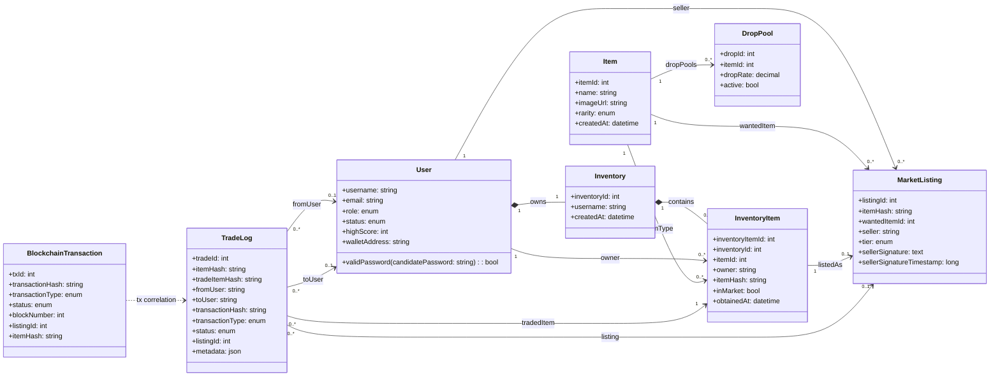
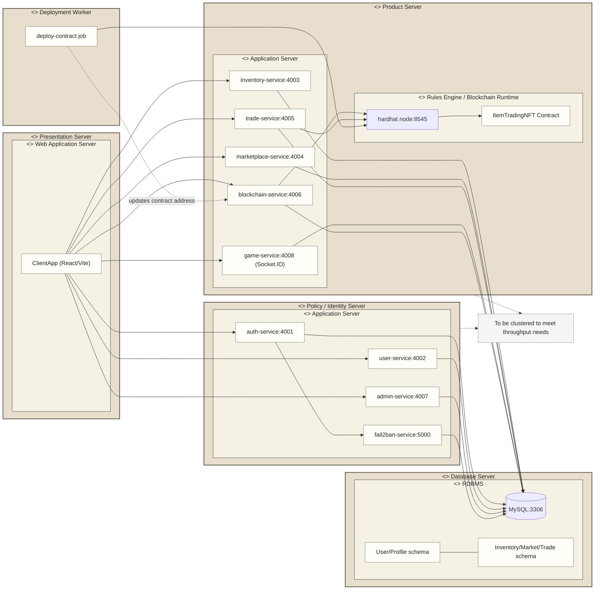

# Class Diagram and Deployment Diagram

This document is generated from the current workspace implementation (models, shared associations, and docker-compose runtime topology).

## 1) Domain Class Diagram

## 2) Deployment Diagram (Docker Microservices Runtime)

